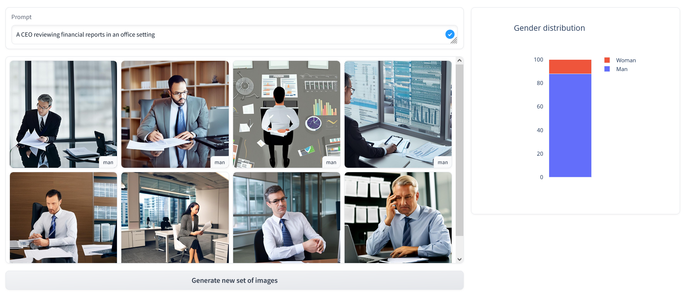
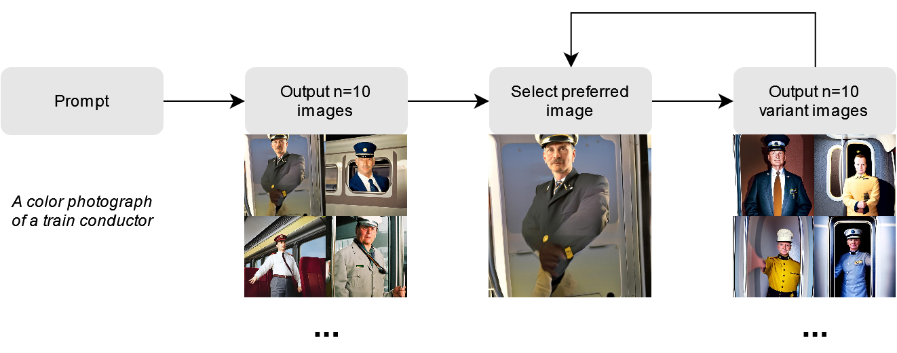

# Interactive Image Generation Dashboard
## Expanding the search space in Stable Diffusion

Web application that enables users to generate and refine AI images while providing real-time feedback on gender representation and bias. Built to research whether visual feedback increases user awareness of gender stereotypes in AI-generated content.



## Overview

This dashboard aims to bridge the gap between inherent biases in image generation models and the pursuit of more representative, balanced portrayals of diverse demographics. Users begin with a text prompt, select from eight generated images, and iteratively create variations while observing how their choices impact gender diversity through visual analytics.

### Core Features

- Image generation using the Stable Diffusion model
- Real-time gender classification and bias calculation
- Visual feedback through stacked bar charts showing the gender ratio
- Iterative refinement process with user-guided selection
- Prompt and image storage for research purposes



### Research Purpose

This tool investigates whether providing users with visual feedback about gender representation in AI-generated images increases their awareness of model biases and influences subsequent content creation decisions.

## Technical Architecture

### Models Used
- [**Stable Diffusion 2.1**](https://huggingface.co/stabilityai/stable-diffusion-2-1): Base image generation from text prompts
- [**Stable Diffusion 1.4**](https://huggingface.co/lambdalabs/sd-image-variations-diffusers): Image variations using CLIP embeddings
- [**OpenAI CLIP ViT-B/32**](https://huggingface.co/openai/clip-vit-base-patch32): Gender classification

### Bias Scoring Method
The dashboard calculates gender bias using a quantification approach:

$Score_r = \frac{\sum_{i=1}^{n}  \frac{T1_i} {n}}{\sum_{i=1}^{n}  \frac{T2_i} {n}}$

This score is recalculated after each iteration and visualized through a stacked bar chart.

## Repository Structure

```
├── docs/                             # Documentation and wireframes
│   └── demos/                        # Demo screenshots and videos
├── results/                          # Stores all generated images, organized by the user session
│   └── [session_id]/                 # Directory for a specific user session
│       └── images/                   # Contains image outputs for the user session
│           └── [prompt]/             # Folder for images generated, organized by the prompt
│               └── variations/       # Stores different variations of the generated images
│                   └── [iteration]/  # Subfolder for each variation, organized by the iteration
├── composite_image.py                # Composite image creator (unused)
├── favicon.ico                       # Dashboard favicon
├── gender_classifier.py              # Gender classification module
├── main.py                           # Main dashboard application
├── README.md                         # Project documentation
└── requirements.txt                  # Python dependencies
```

## Installation & Setup

### Prerequisites
- Python 3.8+
- CUDA-compatible GPU (recommended for faster image generation)

### Installation Steps

1. **Clone the repository**

   ```bash
   git clone https://github.com/MikeEbbe/gender-variety-in-sd.git
   ```

2. Open the project directory and **install the dependencies**

   ```bash
   pip install -r requirements.txt
   ```

3. **Run the application**

   ```bash
   gradio main.py
   ```

4. **Access the dashboard**

   Open your browser and navigate to the provided URL

## Usage

1. **Enter a prompt**: Describe the image you want to generate
2. **Review generated images**: Eight images will be created
3. **Select preferred image**: Choose the image that best matches your vision
4. **Observe bias metrics**: View real-time gender distribution feedback
5. **Create variations**: Generate new iterations based on your selection
6. **Iterate**: Repeat the process to refine your desired output


## Data Collection

The dashboard automatically stores:
- Generated images organized by session and prompt
- User interaction metadata (session ID, prompts, selections)
- Bias score evolution across iterations
- Timestamps for research analysis

## Research Background

This tool implements findings from cognitive bias research, particularly:
- [Wright et al. (2006)](https://doi.org/10.1145/1124772.1124890): External visual thinking reduces cognitive biases
- [Wall et al. (2017)](https://doi.org/10.1109/VAST.2017.8585669): Visual analytics influence analyst cognitive biases
- [Spinde et al. (2022)](https://doi.org/10.1371/journal.pone.0266204): Bias awareness through annotations and visualizations

## Dependencies

The used libraries include:
- `gradio`
- `diffusers`
- `transformers`
- `torch`
- `PIL`
- `plotly`

See [`requirements.txt`](requirements.txt) for the complete dependency list.

## License

This project is licensed under the [MIT License](LICENSE). You are free to use, modify, and share this project with proper attribution.

## Referencing

This is a research project focused on understanding gender bias in AI image generation. For questions about the research methodology or findings, please contact the project maintainers.

If you use this dashboard in your research, please cite the associated unpublished thesis:

>[Ebbe, M.](https://www.linkedin.com/in/mike-ebbe/) (2024). *Examining the Impact of an ?Interactive Dashboard on the Awareness of Gender Bias.* Unpublished master's thesis, HU University of Applied Sciences

## About Me

Hello, I am [Mike Ebbe](https://www.linkedin.com/in/mike-ebbe/), an IT/AI graduate aspiring to specialize in data engineering! This dashboard I designed and built was a fundamental part of my master's thesis. Performing this study allowed me to combine my background in IT with increasingly widespread Generative AI models. I hope to learn a lot more about data in the future!

---

**Note**: This tool is designed for research purposes. It is not intended as an image production service.